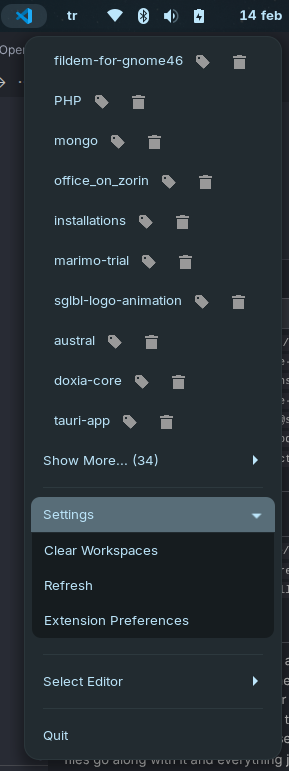
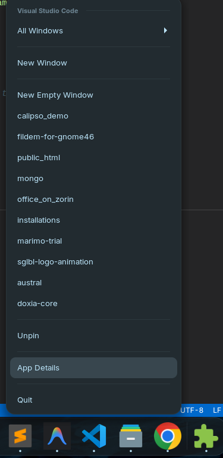

### VSCode Workspaces Extension

#### Installation

1. Copy the extension folder to the extensions directory.
    ```bash
    # Remove existing installation if present
    rm -rf ~/.local/share/gnome-shell/extensions/vscode-workspaces@sglbl.com

    # Copy the extension files (adjust source folder name if necessary)
    cp -r vscode-workspaces@sglbl.com ~/.local/share/gnome-shell/extensions/vscode-workspaces@sglbl.com
    ```

2. Restart GNOME Shell (required for new extensions to be discovered):
   - **X11**: Press `Alt+F2`, type `r`, then `Enter`.
   - **Wayland**: Log out and log back in.

3. Enable the extension:

    ```bash
    gnome-extensions enable vscode-workspaces@sglbl.com
    # or open GNOME Extensions app and enable it from there.
    ```

#### Features
- Support recent workspaces by their order  


- Support right click on dock to open recent workspaces (Similar to Windows/MacOS Jump List, Optional)  
 

#### Enable Dock Integration (Optional)

To enable recent workspaces in the dock right-click menu (Dash-to-Dock / Zorin Dash):

```bash
# Create systemd user directory if it doesn't exist
mkdir -p ~/.config/systemd/user

# Link the service and timer from the installed extension
ln -sf ~/.local/share/gnome-shell/extensions/vscode-workspaces@sglbl.com/vscode-dock-actions.service ~/.config/systemd/user/
ln -sf ~/.local/share/gnome-shell/extensions/vscode-workspaces@sglbl.com/vscode-dock-actions.timer ~/.config/systemd/user/

# Reload systemd and enable the timer (on startup and once an hour refresh)
systemctl --user daemon-reload
systemctl --user enable --now vscode-dock-actions.timer
```
